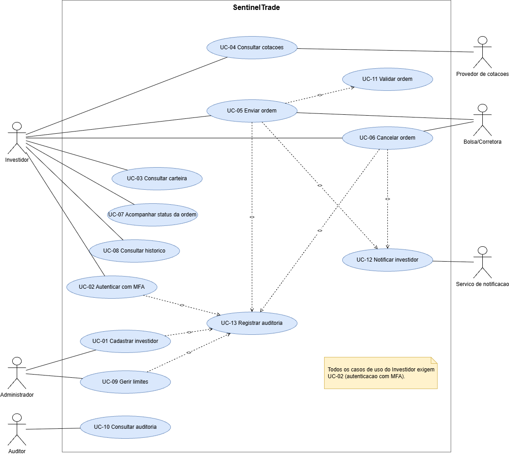

# SentinelTrade

O SentinelTrade eh uma plataforma de trade para a corretora fictícia Orion Capital, com autenticação MFA, ordens de compra e venda, auditoria imutavel e tolerancia a falhas.

## Escopo e estado atual

Trabalho de especificação e modelagem, com ativos, contas e cotacoes
simuladas (sem bolsa real e sem dinheiro real). Ainda não ha aplicacao
para executar, a documentacao esta em `docs/`.

## Integrante

- Andres dos Santos Boada, RA 10736789

## Tecnologias

- Java 21
- Maven/Gradle (a decidir)
- Banco de dados (a decidir)
- draw.io

## Estrutura do Repositorio

docs/           requisitos, diagramas e evidências
.env.example    modelo de variáveis de ambiente
.gitignore
README.md

## Instrucoes de execucao

1. clonar o repositorio
```bash
git clone https://github.com/Andres-10736789/SentinelTrade
cd SentinelTrade
```
2. copiar `.env.example` para .env e substituir valores placeholder

```bash
cp .env.example .env
```

**nunca comite o .env** 

3. Carregar as variaveis (ainda nao implementado)

4. Subir a aplicacao (ainda nao implementada)

5. Executar os testes (ainda nao implementado)

## Estrutura do repositorio

```
docs/
  requerimentos/
    atores.md
    requisitos.md
    regrasdeNegocio.md
    restricoesTecnicas.md
    criteriosdeAceitacao.md
    matrizdeRastreabilidade.md
  diagrama/
    casosdeUso.drawio
    casosdeUso.drawio.png
.env.example
.gitignore
README.md
```

## Documentacao

- [Atores](docs/requerimentos/atores.md)
- [Requisitos funcionais e nao funcionais](docs/requerimentos/requisitos.md)
- [Regras de negocio](docs/requerimentos/regrasdeNegocio.md)
- [Restricoes tecnicas](docs/requerimentos/restricoesTecnicas.md)
- [Criterios de aceitacao](docs/requerimentos/criteriosdeAceitacao.md)
- [Matriz de rastreabilidade](docs/requerimentos/matrizdeRastreabilidade.md)

### Diagrama de casos de uso



Arquivo-fonte editavel: [casosdeUso.drawio](docs/diagrama/casosdeUso.drawio)